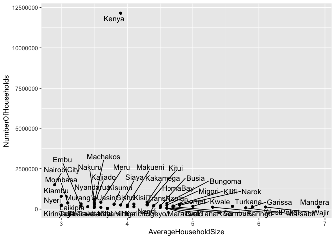

2021-01-19
================
Brady Johnston
19/01/2021

## First Look

``` r
households %>% head()
```

    ## # A tibble: 6 x 4
    ##   County         Population NumberOfHouseholds AverageHouseholdSize
    ##   <chr>               <dbl>              <dbl>                <dbl>
    ## 1 "Kenya   "       47213282           12143913                  3.9
    ## 2 "Mombasa   "      1190987             378422                  3.1
    ## 3 "Kwale  "          858748             173176                  5  
    ## 4 "Kilifi  "        1440958             298472                  4.8
    ## 5 "TanaRiver   "     314710              68242                  4.6
    ## 6 "Lamu   "          141909              37963                  3.7

``` r
crops %>% 
  head()
```

    ## # A tibble: 6 x 11
    ##   SubCounty Farming    Tea Coffee Avocado Citrus  Mango Coconut Macadamia
    ##   <chr>       <dbl>  <dbl>  <dbl>   <dbl>  <dbl>  <dbl>   <dbl>     <dbl>
    ## 1 KENYA     6354211 476613 478936  966976 177445 796867   90952    195999
    ## 2 MOMBASA     12497     NA     NA      NA     NA     NA    1688        NA
    ## 3 KWALE      108074     NA     NA    1063  10053  30272   31954       881
    ## 4 KILIFI     161188     NA     NA      NA   6808  37519   47561        NA
    ## 5 TANA RIV…   35094     NA     NA      NA   1109   6561    2228        NA
    ## 6 LAMU        18678     NA     NA      NA   2742   7423    5017       189
    ## # … with 2 more variables: `Cashew Nut` <dbl>, `Khat (Miraa)` <dbl>

``` r
gender %>%
  head()
```

    ## # A tibble: 6 x 5
    ##   County         Male   Female Intersex    Total
    ##   <chr>         <dbl>    <dbl>    <dbl>    <dbl>
    ## 1 Total      23548056 24014716     1524 47564296
    ## 2 Mombasa      610257   598046       30  1208333
    ## 3 Kwale        425121   441681       18   866820
    ## 4 Kilifi       704089   749673       25  1453787
    ## 5 Tana River   158550   157391        2   315943
    ## 6 Lamu          76103    67813        4   143920

## Some initial plotting

``` r
crops %>%
  ggplot(aes(x = SubCounty, 
             y = Farming)) + 
  geom_col() + 
  theme(axis.text.x = element_text(angle = 90, hjust = 1, vjust = 0.5))
```

<!-- -->

Looksk like most of the farming is done in Kenya. What about if we
exclude it?

``` r
crops %>%
  filter(SubCounty != "KENYA") %>% 
  ggplot(aes(x = SubCounty, 
             y = Farming)) + 
  geom_col() + 
  theme(axis.text.x = element_text(angle = 90, hjust = 1, vjust = 0.5))
```

<!-- -->

``` r
crops %>% 
  filter(SubCounty != "KENYA") %>% 
  pivot_longer(cols = 3:ncol(crops), names_to = "Crop") %>%
  
  ggplot(aes(y = SubCounty, 
             x = value, 
             fill = Crop)) +
  geom_col() + 
  # facet_wrap(~Crop) + 
  theme( legend.position = "") + 
  theme_classic(base_size = 6)
```

    ## Warning: Removed 232 rows containing missing values (position_stack).

<!-- -->

Looks like there is a bunch of white space trailing the Counties.

``` r
households %>% head() %>% pull(County)
```

    ## [1] "Kenya   "     "Mombasa   "   "Kwale  "      "Kilifi  "     "TanaRiver   "
    ## [6] "Lamu   "

``` r
households <- households %>%
  mutate(County = stringr::str_trim(County))
  
households %>% head() %>%
pull(County)
```

    ## [1] "Kenya"     "Mombasa"   "Kwale"     "Kilifi"    "TanaRiver" "Lamu"

That is now looking better and should play nicer with the filters.

``` r
p1 <- households %>%
  # filter(County != "Kenya") %>%
  ggplot(aes(x = AverageHouseholdSize, 
             y = NumberOfHouseholds)) + 
  geom_point()
p1
```

<!-- -->

``` r
library(ggrepel)
p1 + geom_text_repel(aes(label = County))
```

<!-- -->

``` r
households %>%
  filter(County != "Kenya") %>%
  ggplot(aes(x = AverageHouseholdSize, 
             y = Population)) + 
  geom_point()
```

<!-- -->

``` r
library(emojifont)

cropnames <- colnames(crops)[3:ncol(crops)]
cropnames
```

    ## [1] "Tea"          "Coffee"       "Avocado"      "Citrus"       "Mango"       
    ## [6] "Coconut"      "Macadamia"    "Cashew Nut"   "Khat (Miraa)"

``` r
# emoji(search_emoji("cocoanut"))

emojicrops <- data.frame(
  crop = cropnames,
  emoji = c("teapot", "coffee", "avocado", "citrus", "mango", "coconut", "macadamia", "cashew", "khat")
)
```

``` r
library(grid)
library(ggtextures)

crops %>% 
  filter(SubCounty != "KENYA") %>%
  pivot_longer(cols = 3:ncol(crops), names_to = 'crop') %>%
  left_join(emojicrops) %>% 
  mutate(emoji = paste0(emoji, ".png")) %>%
  # mutate(image = readPNG(paste0(emoji, ".png"))) %>% head()
ggplot(aes(x = crop, 
           y = value)) + 
  # geom_image(aes(image = emoji)) + 
  geom_textured_col(aes(
    image = emoji
  ), fill = NA, colour = NA) + 
  theme_void() + 
  # facet_wrap(~SubCounty, strip.position = "bottom") + 
  theme(panel.border = element_rect(fill = NA)) + 
  labs(title = "hello")
```

    ## Joining, by = "crop"

    ## Warning: Removed 232 rows containing missing values (position_stack).

<!-- -->

``` r
library(waffle)

crops %>% 
  filter(SubCounty != "KENYA") %>%
  pivot_longer(cols = 3:ncol(crops), names_to = "crop") %>%
  filter(!is.na(value)) %>%
  ggplot(aes(fill = SubCounty, values = value/1000), colour = NA) + 
  geom_waffle(n_rows = 10, make_proportional = T) + 
  facet_wrap(~crop) + 
  theme_void() +
  theme(legend.position = "")
```

<!-- -->

``` r
ggsave("testing.pdf")
```

    ## Saving 7 x 5 in image
